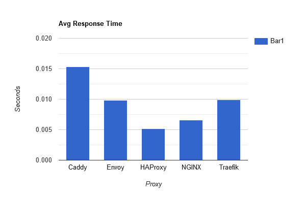

# Benchmarks

**Updated: February 21, 2021**

Tests performance of various load balancers. Based on the blog post https://www.loggly.com/blog/benchmarking-5-popular-load-balancers-nginx-haproxy-envoy-traefik-and-alb/. Note that I did update the NGINX config to use `upstream` with a few recommended defaults so that it was somewhat more fair.

NOTE: I got VERY different results from what Loggly reported. They reported Envoy as being far ahead in performance. I saw that
HAProxy is ahead. Note that you can install HAProxy using the packages here: https://haproxy.debian.net. The Terraform installation automates this.

**IMPORTANT! Be sure to SSH into one of the VMs and run the test against the other VM from there. Running the test from within the AWS VPC will reduce Internet latency.**

Defaults to the AWS "US-East-2 (Ohio)" region.

NOTE: The AWS plugin for Terraform can be finicky. The deployment may or may not work the first time. In that case, 
use `terraform taint aws_instance.envoy` for example to try it again.

## Setup

Perform these steps:

1. In the [AWS Console](https://console.aws.amazon.com), create a new SSH keypair (default name is "benchmarks"):
    * Go to __EC2 > Key Pairs > Create Key Pair__.
    * Name it "benchmarks".
    * Save the .pem file to this project's directory.
    * Update the file's permissions with `chmod 400 ./benchmarks.pem`
2. Run:
```
terraform init
terraform apply -auto-approve -var 'aws_access_key=<YOUR_ACCESS_KEY>' -var 'aws_secret_key=<YOUR_SECRET_KEY>'
```
3. Log into a server with `ssh -i ./benchmarks.pem ubuntu@<IP_ADDRESS>` and run Hey against one of the other servers.

To tear down the servers:

```
terraform destroy -force -var 'aws_access_key=<YOUR_ACCESS_KEY>' -var 'aws_secret_key=<YOUR_SECRET_KEY>'
```

Test with: https://github.com/rakyll/hey. It should be installed already on each VM in /home/ubuntu. You should SSH into one of the AWS VMs and run the benchmarking tool from there so that you do not run into latency.

```
./hey -n 100000 -c 250 -m GET http://<IP_ADDRESS>
```

Or with Apache Bench:

```
sudo ab -n 100000 -c 250 -m GET http://<IP_ADDRESS>/
```

## Results using Hey





*Graphs created using https://www.rapidtables.com/tools/bar-graph.html*

### Caddy (2.3.0)

```
Summary:
  Total:        6.2389 secs
  Slowest:      0.1989 secs
  Fastest:      0.0004 secs
  Average:      0.0153 secs
  Requests/sec: 16028.3429

  Total data:   19200000 bytes
  Size/request: 192 bytes

Response time histogram:
  0.000 [1]     |
  0.020 [77758] |■■■■■■■■■■■■■■■■■■■■■■■■■■■■■■■■■■■■■■■■
  0.040 [19203] |■■■■■■■■■■
  0.060 [1622]  |■
  0.080 [777]   |
  0.100 [420]   |
  0.119 [157]   |
  0.139 [35]    |
  0.159 [25]    |
  0.179 [1]     |
  0.199 [1]     |


Latency distribution:
  10% in 0.0049 secs
  25% in 0.0081 secs
  50% in 0.0128 secs
  75% in 0.0193 secs
  90% in 0.0266 secs
  95% in 0.0331 secs
  99% in 0.0679 secs

Details (average, fastest, slowest):
  DNS+dialup:   0.0000 secs, 0.0004 secs, 0.1989 secs
  DNS-lookup:   0.0000 secs, 0.0000 secs, 0.0000 secs
  req write:    0.0000 secs, 0.0000 secs, 0.0039 secs
  resp wait:    0.0153 secs, 0.0004 secs, 0.1988 secs
  resp read:    0.0000 secs, 0.0000 secs, 0.0031 secs

Status code distribution:
  [200] 100000 responses
```


### Envoy (1.17.0)

```
Summary:
  Total:        3.9836 secs
  Slowest:      0.1271 secs
  Fastest:      0.0004 secs
  Average:      0.0098 secs
  Requests/sec: 25103.1608

  Total data:   26700000 bytes
  Size/request: 267 bytes

Response time histogram:
  0.000 [1]     |
  0.013 [91277] |■■■■■■■■■■■■■■■■■■■■■■■■■■■■■■■■■■■■■■■■
  0.026 [8472]  |■■■■
  0.038 [0]     |
  0.051 [0]     |
  0.064 [0]     |
  0.076 [0]     |
  0.089 [37]    |
  0.102 [0]     |
  0.114 [138]   |
  0.127 [75]    |


Latency distribution:
  10% in 0.0071 secs
  25% in 0.0080 secs
  50% in 0.0093 secs
  75% in 0.0108 secs
  90% in 0.0129 secs
  95% in 0.0139 secs
  99% in 0.0171 secs

Details (average, fastest, slowest):
  DNS+dialup:   0.0000 secs, 0.0004 secs, 0.1271 secs
  DNS-lookup:   0.0000 secs, 0.0000 secs, 0.0000 secs
  req write:    0.0000 secs, 0.0000 secs, 0.0066 secs
  resp wait:    0.0097 secs, 0.0004 secs, 0.1243 secs
  resp read:    0.0001 secs, 0.0000 secs, 0.0097 secs

Status code distribution:
  [200] 100000 responses
```

### HAProxy (2.3.5)

```
Summary:
  Total:        2.1166 secs
  Slowest:      0.0780 secs
  Fastest:      0.0003 secs
  Average:      0.0052 secs
  Requests/sec: 47244.7741

  Total data:   13600000 bytes
  Size/request: 136 bytes

Response time histogram:
  0.000 [1]     |
  0.008 [85484] |■■■■■■■■■■■■■■■■■■■■■■■■■■■■■■■■■■■■■■■■
  0.016 [12605] |■■■■■■
  0.024 [1440]  |■
  0.031 [199]   |
  0.039 [19]    |
  0.047 [2]     |
  0.055 [2]     |
  0.062 [3]     |
  0.070 [135]   |
  0.078 [110]   |


Latency distribution:
  10% in 0.0014 secs
  25% in 0.0027 secs
  50% in 0.0043 secs
  75% in 0.0063 secs
  90% in 0.0093 secs
  95% in 0.0117 secs
  99% in 0.0195 secs

Details (average, fastest, slowest):
  DNS+dialup:   0.0000 secs, 0.0003 secs, 0.0780 secs
  DNS-lookup:   0.0000 secs, 0.0000 secs, 0.0000 secs
  req write:    0.0000 secs, 0.0000 secs, 0.0086 secs
  resp wait:    0.0050 secs, 0.0003 secs, 0.0749 secs
  resp read:    0.0001 secs, 0.0000 secs, 0.0097 secs

Status code distribution:
  [200] 100000 responses
```

### NGINX (1.19.7)

```
Summary:
  Total:        2.7157 secs
  Slowest:      0.0579 secs
  Fastest:      0.0003 secs
  Average:      0.0066 secs
  Requests/sec: 36822.9500

  Total data:   12700000 bytes
  Size/request: 127 bytes

Response time histogram:
  0.000 [1]     |
  0.006 [54933] |■■■■■■■■■■■■■■■■■■■■■■■■■■■■■■■■■■■■■■■■
  0.012 [34712] |■■■■■■■■■■■■■■■■■■■■■■■■■
  0.018 [8025]  |■■■■■■
  0.023 [1511]  |■
  0.029 [483]   |
  0.035 [214]   |
  0.041 [51]    |
  0.046 [28]    |
  0.052 [11]    |
  0.058 [31]    |


Latency distribution:
  10% in 0.0019 secs
  25% in 0.0035 secs
  50% in 0.0055 secs
  75% in 0.0088 secs
  90% in 0.0120 secs
  95% in 0.0144 secs
  99% in 0.0219 secs

Details (average, fastest, slowest):
  DNS+dialup:   0.0000 secs, 0.0003 secs, 0.0579 secs
  DNS-lookup:   0.0000 secs, 0.0000 secs, 0.0000 secs
  req write:    0.0000 secs, 0.0000 secs, 0.0325 secs
  resp wait:    0.0064 secs, 0.0003 secs, 0.0413 secs
  resp read:    0.0001 secs, 0.0000 secs, 0.0297 secs

Status code distribution:
  [200] 100000 responses
```

### Traefik (2.4.5)

```
Summary:
  Total:        4.0510 secs
  Slowest:      0.2336 secs
  Fastest:      0.0004 secs
  Average:      0.0099 secs
  Requests/sec: 24685.0659

  Total data:   30300000 bytes
  Size/request: 303 bytes

Response time histogram:
  0.000 [1]     |
  0.024 [97774] |■■■■■■■■■■■■■■■■■■■■■■■■■■■■■■■■■■■■■■■■
  0.047 [2027]  |■
  0.070 [46]    |
  0.094 [136]   |
  0.117 [12]    |
  0.140 [0]     |
  0.164 [0]     |
  0.187 [0]     |
  0.210 [0]     |
  0.234 [4]     |


Latency distribution:
  10% in 0.0036 secs
  25% in 0.0057 secs
  50% in 0.0089 secs
  75% in 0.0128 secs
  90% in 0.0172 secs
  95% in 0.0201 secs
  99% in 0.0278 secs

Details (average, fastest, slowest):
  DNS+dialup:   0.0000 secs, 0.0004 secs, 0.2336 secs
  DNS-lookup:   0.0000 secs, 0.0000 secs, 0.0000 secs
  req write:    0.0000 secs, 0.0000 secs, 0.0179 secs
  resp wait:    0.0099 secs, 0.0004 secs, 0.2336 secs
  resp read:    0.0000 secs, 0.0000 secs, 0.0188 secs

Status code distribution:
  [200] 100000 responses
```
