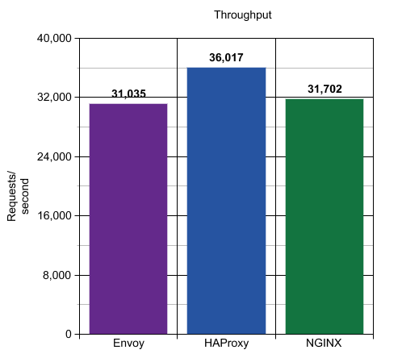

# Benchmarks

Tests performance of various load balancers. Based on the blog post https://www.loggly.com/blog/benchmarking-5-popular-load-balancers-nginx-haproxy-envoy-traefik-and-alb/. Note that I did update the NGINX config to use `upstream` with a few recommended defaults so that it was somewhat more fair.

NOTE: I got VERY different results from what Loggly reported. They reported Envoy as being far ahead in performance. I saw that
HAProxy is ahead. Note that you can install HAProxy using the packages here: https://haproxy.debian.net. The Terraform installation automates this.

**IMPORTANT! Be sure to SSH into one of the VMs and run the test against the other VM from there. Running the test from within the AWS VPC will reduce Internet latency.**

Defaults to the AWS "US-East-2 (Ohio)" region.

NOTE: The AWS plugin for Terraform can be finicky. The deployment may or may not work the first time. In that case, 
use `terraform taint aws_instance.envoy` for example to try it again.

## Setup

Perform these steps:

1. In the [AWS Console](https://console.aws.amazon.com), create a new SSH keypair (default name is "benchmarks"):
    * Go to __EC2 > Key Pairs > Create Key Pair__.
    * Name it "benchmarks".
    * Save the .pem file to this project's directory.
    * Update the file's permissions with `chmod 400 ./benchmarks.pem`
2. Run:
```
terraform init
terraform apply -auto-approve -var 'aws_access_key=<YOUR_ACCESS_KEY>' -var 'aws_secret_key=<YOUR_SECRET_KEY>'
```
3. Log into a server with `ssh -i ./benchmarks.pem ubuntu@<IP_ADDRESS>`

To tear down the servers:

```
terraform destroy -force -var 'aws_access_key=<YOUR_ACCESS_KEY>' -var 'aws_secret_key=<YOUR_SECRET_KEY>'
```

Test with: https://github.com/rakyll/hey. It should be installed already on each VM in /home/ubuntu. You should SSH into one of the AWS VMs and run the benchmarking tool from there so that you do not run into latency.

```
hey -n 100000 -c 250 -m GET http://<IP_ADDRESS>
```

Or with Apache Bench:

```
sudo ab -n 100000 -c 250 -m GET http://<IP_ADDRESS>/
```

## Results using Hey




### Envoy (version 1.11.0)

```
Summary:
  Total:        3.2221 secs
  Slowest:      0.0421 secs
  Fastest:      0.0003 secs
  Average:      0.0079 secs
  Requests/sec: 31035.4910
  
  Total data:   26700000 bytes
  Size/request: 267 bytes

Response time histogram:
  0.000 [1]     |
  0.005 [26920] |■■■■■■■■■■■■■■■■■■■■■■■■■■■■■■■■
  0.009 [34094] |■■■■■■■■■■■■■■■■■■■■■■■■■■■■■■■■■■■■■■■■
  0.013 [24994] |■■■■■■■■■■■■■■■■■■■■■■■■■■■■■
  0.017 [9787]  |■■■■■■■■■■■
  0.021 [2870]  |■■■
  0.025 [872]   |■
  0.030 [290]   |
  0.034 [119]   |
  0.038 [37]    |
  0.042 [16]    |


Latency distribution:
  10% in 0.0023 secs
  25% in 0.0043 secs
  50% in 0.0074 secs
  75% in 0.0106 secs
  90% in 0.0140 secs
  95% in 0.0164 secs
  99% in 0.0224 secs

Details (average, fastest, slowest):
  DNS+dialup:   0.0000 secs, 0.0003 secs, 0.0421 secs
  DNS-lookup:   0.0000 secs, 0.0000 secs, 0.0000 secs
  req write:    0.0000 secs, 0.0000 secs, 0.0206 secs
  resp wait:    0.0077 secs, 0.0003 secs, 0.0418 secs
  resp read:    0.0001 secs, 0.0000 secs, 0.0070 secs

Status code distribution:
  [200] 100000 responses
```

### NGINX (version 1.10.3)

```
Summary:
  Total:        3.1544 secs
  Slowest:      1.0094 secs
  Fastest:      0.0002 secs
  Average:      0.0076 secs
  Requests/sec: 31702.2366
  
  Total data:   12700000 bytes
  Size/request: 127 bytes

Response time histogram:
  0.000 [1]     |
  0.101 [99994] |■■■■■■■■■■■■■■■■■■■■■■■■■■■■■■■■■■■■■■■■
  0.202 [0]     |
  0.303 [1]     |
  0.404 [0]     |
  0.505 [0]     |
  0.606 [0]     |
  0.707 [0]     |
  0.808 [0]     |
  0.909 [0]     |
  1.009 [4]     |


Latency distribution:
  10% in 0.0015 secs
  25% in 0.0037 secs
  50% in 0.0068 secs
  75% in 0.0100 secs
  90% in 0.0141 secs
  95% in 0.0176 secs
  99% in 0.0275 secs

Details (average, fastest, slowest):
  DNS+dialup:   0.0000 secs, 0.0002 secs, 1.0094 secs
  DNS-lookup:   0.0000 secs, 0.0000 secs, 0.0000 secs
  req write:    0.0000 secs, 0.0000 secs, 0.0193 secs
  resp wait:    0.0075 secs, 0.0002 secs, 1.0094 secs
  resp read:    0.0001 secs, 0.0000 secs, 0.0080 secs

Status code distribution:
  [200] 100000 responses
```

### HAProxy (version 2.0)

```
Summary:
  Total:        2.7764 secs
  Slowest:      0.0467 secs
  Fastest:      0.0003 secs
  Average:      0.0068 secs
  Requests/sec: 36017.9772
  
  Total data:   13700000 bytes
  Size/request: 137 bytes

Response time histogram:
  0.000 [1]     |
  0.005 [37766] |■■■■■■■■■■■■■■■■■■■■■■■■■■■■■■■■■■■■■■
  0.010 [39441] |■■■■■■■■■■■■■■■■■■■■■■■■■■■■■■■■■■■■■■■■
  0.014 [16488] |■■■■■■■■■■■■■■■■■
  0.019 [4413]  |■■■■
  0.023 [1262]  |■
  0.028 [432]   |
  0.033 [153]   |
  0.037 [41]    |
  0.042 [2]     |
  0.047 [1]     |


Latency distribution:
  10% in 0.0014 secs
  25% in 0.0035 secs
  50% in 0.0062 secs
  75% in 0.0092 secs
  90% in 0.0126 secs
  95% in 0.0150 secs
  99% in 0.0215 secs

Details (average, fastest, slowest):
  DNS+dialup:   0.0000 secs, 0.0003 secs, 0.0467 secs
  DNS-lookup:   0.0000 secs, 0.0000 secs, 0.0000 secs
  req write:    0.0000 secs, 0.0000 secs, 0.0128 secs
  resp wait:    0.0066 secs, 0.0002 secs, 0.0467 secs
  resp read:    0.0001 secs, 0.0000 secs, 0.0109 secs

Status code distribution:
  [200] 100000 responses
```

## CPU and Memory usage during tests

Envoy:

CPU: 280.7%
Memory: 0.3

NGINX:

CPU: 100%
Memory: 0.0

HAProxy:

CPU: 63.3%
Memory: 0.1%
