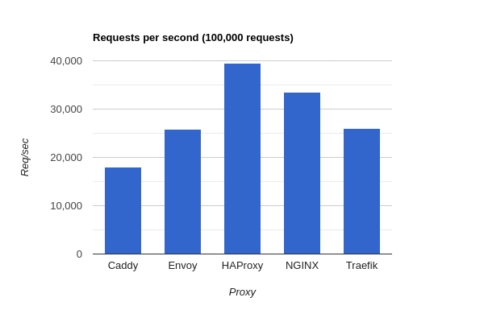
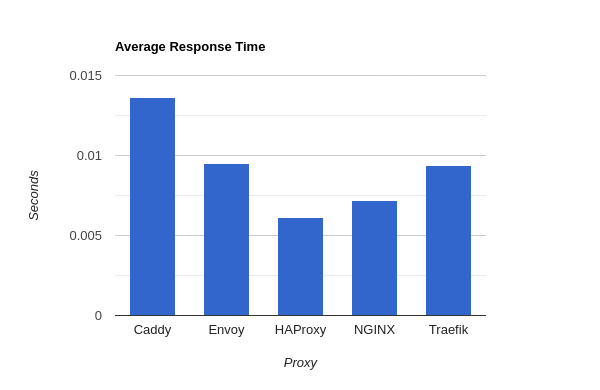

# Benchmarks

Tests performance of various proxies/load balancers. Based on the blog post https://www.loggly.com/blog/benchmarking-5-popular-load-balancers-nginx-haproxy-envoy-traefik-and-alb/.

We test the following proxies:

* Caddy
* Envoy
* HAProxy
* NGINX
* Traefik

**IMPORTANT! Be sure to SSH into the client VM and run the test against the proxy_server VM from there. Running the test from within the AWS VPC will reduce Internet latency.**

Defaults to the AWS "US-East-2 (Ohio)" region.

NOTE: The AWS plugin for Terraform can be finicky. The deployment may or may not work the first time. In that case, 
use `terraform taint aws_instance.proxy_server` for example to try it again.

## Setup

Perform these steps:

1. In the [AWS Console](https://console.aws.amazon.com), create a new SSH keypair (default name is "benchmarks"):
    * Go to __EC2 > Key Pairs > Create Key Pair__.
    * Name it "benchmarks".
    * Save the .pem file to this project's directory.
    * Update the file's permissions with `chmod 400 ./benchmarks.pem`
2. Run:
```
terraform init
terraform apply -auto-approve -var 'aws_access_key=<YOUR_ACCESS_KEY>' -var 'aws_secret_key=<YOUR_SECRET_KEY>'
```
3. Log into the *client* server with `ssh -i ./benchmarks.pem ubuntu@<IP_ADDRESS>` and run the tests:

```
/tmp/run_tests.sh | tee results.txt
```

Performance tests use https://github.com/rakyll/hey.

To tear down the servers:

```
terraform destroy -force -var 'aws_access_key=<YOUR_ACCESS_KEY>' -var 'aws_secret_key=<YOUR_SECRET_KEY>'
```

## Results using Hey






*Graphs created using https://www.rapidtables.com/tools/bar-graph.html*

### Caddy (2.6.4)

```
Summary:
  Total:        5.5605 secs
  Slowest:      0.1183 secs
  Fastest:      0.0003 secs
  Average:      0.0136 secs
  Requests/sec: 17983.9983
  
  Total data:   23000000 bytes
  Size/request: 230 bytes

Response time histogram:
  0.000 [1]     |
  0.012 [50511] |■■■■■■■■■■■■■■■■■■■■■■■■■■■■■■■■■■■■■■■■
  0.024 [39038] |■■■■■■■■■■■■■■■■■■■■■■■■■■■■■■■
  0.036 [8895]  |■■■■■■■
  0.048 [928]   |■
  0.059 [185]   |
  0.071 [206]   |
  0.083 [93]    |
  0.095 [95]    |
  0.107 [19]    |
  0.118 [29]    |


Latency distribution:
  10% in 0.0045 secs
  25% in 0.0075 secs
  50% in 0.0120 secs
  75% in 0.0180 secs
  90% in 0.0242 secs
  95% in 0.0283 secs
  99% in 0.0396 secs

Details (average, fastest, slowest):
  DNS+dialup:   0.0000 secs, 0.0003 secs, 0.1183 secs
  DNS-lookup:   0.0000 secs, 0.0000 secs, 0.0000 secs
  req write:    0.0000 secs, 0.0000 secs, 0.0079 secs
  resp wait:    0.0136 secs, 0.0003 secs, 0.1159 secs
  resp read:    0.0000 secs, 0.0000 secs, 0.0055 secs

Status code distribution:
  [200] 100000 responses
```


### Envoy (1.22.8)

```
Summary:
  Total:        3.8682 secs
  Slowest:      0.1110 secs
  Fastest:      0.0003 secs
  Average:      0.0095 secs
  Requests/sec: 25852.1492
  
  Total data:   25300000 bytes
  Size/request: 253 bytes

Response time histogram:
  0.000 [1]     |
  0.011 [83755] |■■■■■■■■■■■■■■■■■■■■■■■■■■■■■■■■■■■■■■■■
  0.022 [15695] |■■■■■■■
  0.034 [299]   |
  0.045 [0]     |
  0.056 [0]     |
  0.067 [6]     |
  0.078 [50]    |
  0.089 [0]     |
  0.100 [69]    |
  0.111 [125]   |


Latency distribution:
  10% in 0.0067 secs
  25% in 0.0079 secs
  50% in 0.0089 secs
  75% in 0.0105 secs
  90% in 0.0126 secs
  95% in 0.0139 secs
  99% in 0.0195 secs

Details (average, fastest, slowest):
  DNS+dialup:   0.0000 secs, 0.0003 secs, 0.1110 secs
  DNS-lookup:   0.0000 secs, 0.0000 secs, 0.0000 secs
  req write:    0.0000 secs, 0.0000 secs, 0.0101 secs
  resp wait:    0.0094 secs, 0.0003 secs, 0.1099 secs
  resp read:    0.0001 secs, 0.0000 secs, 0.0087 secs

Status code distribution:
  [200] 100000 responses
```

### HAProxy (2.7.3)

```
Summary:
  Total:        2.5357 secs
  Slowest:      0.0916 secs
  Fastest:      0.0002 secs
  Average:      0.0061 secs
  Requests/sec: 39437.2211
  
  Total data:   14000000 bytes
  Size/request: 140 bytes

Response time histogram:
  0.000 [1]     |
  0.009 [80753] |■■■■■■■■■■■■■■■■■■■■■■■■■■■■■■■■■■■■■■■■
  0.019 [14220] |■■■■■■■
  0.028 [3604]  |■■
  0.037 [857]   |
  0.046 [213]   |
  0.055 [191]   |
  0.064 [41]    |
  0.073 [57]    |
  0.083 [57]    |
  0.092 [6]     |


Latency distribution:
  10% in 0.0009 secs
  25% in 0.0019 secs
  50% in 0.0041 secs
  75% in 0.0078 secs
  90% in 0.0138 secs
  95% in 0.0185 secs
  99% in 0.0306 secs

Details (average, fastest, slowest):
  DNS+dialup:   0.0000 secs, 0.0002 secs, 0.0916 secs
  DNS-lookup:   0.0000 secs, 0.0000 secs, 0.0000 secs
  req write:    0.0000 secs, 0.0000 secs, 0.0087 secs
  resp wait:    0.0060 secs, 0.0002 secs, 0.0880 secs
  resp read:    0.0001 secs, 0.0000 secs, 0.0106 secs

Status code distribution:
  [200] 100000 responses
```

### NGINX (1.22.1)

```
Summary:
  Total:        2.9845 secs
  Slowest:      0.0671 secs
  Fastest:      0.0002 secs
  Average:      0.0072 secs
  Requests/sec: 33506.2571
  
  Total data:   12600000 bytes
  Size/request: 126 bytes

Response time histogram:
  0.000 [1]     |
  0.007 [60989] |■■■■■■■■■■■■■■■■■■■■■■■■■■■■■■■■■■■■■■■■
  0.014 [26929] |■■■■■■■■■■■■■■■■■■
  0.020 [8369]  |■■■■■
  0.027 [2586]  |■■
  0.034 [791]   |■
  0.040 [203]   |
  0.047 [83]    |
  0.054 [44]    |
  0.060 [3]     |
  0.067 [2]     |


Latency distribution:
  10% in 0.0019 secs
  25% in 0.0035 secs
  50% in 0.0057 secs
  75% in 0.0092 secs
  90% in 0.0147 secs
  95% in 0.0187 secs
  99% in 0.0275 secs

Details (average, fastest, slowest):
  DNS+dialup:   0.0000 secs, 0.0002 secs, 0.0671 secs
  DNS-lookup:   0.0000 secs, 0.0000 secs, 0.0000 secs
  req write:    0.0000 secs, 0.0000 secs, 0.0211 secs
  resp wait:    0.0071 secs, 0.0002 secs, 0.0670 secs
  resp read:    0.0000 secs, 0.0000 secs, 0.0207 secs

Status code distribution:
  [200] 100000 responses
```

### Traefik (2.9.8)

```
Summary:
  Total:        3.8469 secs
  Slowest:      0.1181 secs
  Fastest:      0.0003 secs
  Average:      0.0094 secs
  Requests/sec: 25994.9553
  
  Total data:   31000000 bytes
  Size/request: 310 bytes

Response time histogram:
  0.000 [1]     |
  0.012 [75314] |■■■■■■■■■■■■■■■■■■■■■■■■■■■■■■■■■■■■■■■■
  0.024 [22329] |■■■■■■■■■■■■
  0.036 [1886]  |■
  0.047 [243]   |
  0.059 [23]    |
  0.071 [50]    |
  0.083 [43]    |
  0.095 [42]    |
  0.106 [50]    |
  0.118 [19]    |


Latency distribution:
  10% in 0.0033 secs
  25% in 0.0054 secs
  50% in 0.0083 secs
  75% in 0.0120 secs
  90% in 0.0164 secs
  95% in 0.0197 secs
  99% in 0.0290 secs

Details (average, fastest, slowest):
  DNS+dialup:   0.0000 secs, 0.0003 secs, 0.1181 secs
  DNS-lookup:   0.0000 secs, 0.0000 secs, 0.0000 secs
  req write:    0.0000 secs, 0.0000 secs, 0.0268 secs
  resp wait:    0.0093 secs, 0.0003 secs, 0.1072 secs
  resp read:    0.0000 secs, 0.0000 secs, 0.0251 secs

Status code distribution:
  [200] 100000 responses
```
