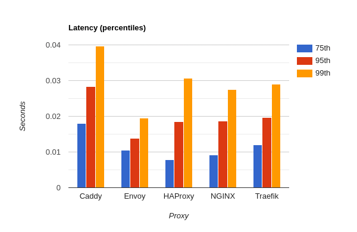

# Benchmarks

**Updated: May 23, 2020**

Tests performance of various load balancers. Based on the blog post https://www.loggly.com/blog/benchmarking-5-popular-load-balancers-nginx-haproxy-envoy-traefik-and-alb/. Note that I did update the NGINX config to use `upstream` with a few recommended defaults so that it was somewhat more fair.

NOTE: I got VERY different results from what Loggly reported. They reported Envoy as being far ahead in performance. I saw that
HAProxy is ahead. Note that you can install HAProxy using the packages here: https://haproxy.debian.net. The Terraform installation automates this.

**IMPORTANT! Be sure to SSH into one of the VMs and run the test against the other VM from there. Running the test from within the AWS VPC will reduce Internet latency.**

Defaults to the AWS "US-East-2 (Ohio)" region.

NOTE: The AWS plugin for Terraform can be finicky. The deployment may or may not work the first time. In that case, 
use `terraform taint aws_instance.envoy` for example to try it again.

## Setup

Perform these steps:

1. In the [AWS Console](https://console.aws.amazon.com), create a new SSH keypair (default name is "benchmarks"):
    * Go to __EC2 > Key Pairs > Create Key Pair__.
    * Name it "benchmarks".
    * Save the .pem file to this project's directory.
    * Update the file's permissions with `chmod 400 ./benchmarks.pem`
2. Run:
```
terraform init
terraform apply -auto-approve -var 'aws_access_key=<YOUR_ACCESS_KEY>' -var 'aws_secret_key=<YOUR_SECRET_KEY>'
```
3. Log into a server with `ssh -i ./benchmarks.pem ubuntu@<IP_ADDRESS>` and run Hey against one of the other servers.

To tear down the servers:

```
terraform destroy -force -var 'aws_access_key=<YOUR_ACCESS_KEY>' -var 'aws_secret_key=<YOUR_SECRET_KEY>'
```

Test with: https://github.com/rakyll/hey. It should be installed already on each VM in /home/ubuntu. You should SSH into one of the AWS VMs and run the benchmarking tool from there so that you do not run into latency.

```
/tmp/hey -n 100000 -c 250 -m GET http://<IP_ADDRESS>
```

Or with Apache Bench:

```
sudo ab -n 100000 -c 250 -m GET http://<IP_ADDRESS>/
```

## Results using Hey




*Graphs created using https://www.rapidtables.com/tools/bar-graph.html*

### Caddy (2.0.0)

```
Summary:
  Total:        63.5207 secs
  Slowest:      4.5481 secs
  Fastest:      0.0004 secs
  Average:      0.1584 secs
  Requests/sec: 1574.2896
  
  Total data:   17136384 bytes
  Size/request: 171 bytes

Response time histogram:
  0.000 [1]     |
  0.455 [86732] |■■■■■■■■■■■■■■■■■■■■■■■■■■■■■■■■■■■■■■■■
  0.910 [7721]  |■■■■
  1.365 [3755]  |■■
  1.819 [1352]  |■
  2.274 [287]   |
  2.729 [95]    |
  3.184 [46]    |
  3.639 [10]    |
  4.093 [0]     |
  4.548 [1]     |


Latency distribution:
  10% in 0.0085 secs
  25% in 0.0168 secs
  50% in 0.0251 secs
  75% in 0.0428 secs
  90% in 0.6543 secs
  95% in 0.9590 secs
  99% in 1.5680 secs

Details (average, fastest, slowest):
  DNS+dialup:   0.0000 secs, 0.0004 secs, 4.5481 secs
  DNS-lookup:   0.0000 secs, 0.0000 secs, 0.0000 secs
  req write:    0.0000 secs, 0.0000 secs, 0.0026 secs
  resp wait:    0.1583 secs, 0.0004 secs, 4.5481 secs
  resp read:    0.0000 secs, 0.0000 secs, 0.0046 secs

Status code distribution:
  [200] 89252 responses
  [502] 10748 responses
```


### Envoy (1.14.1)

```
Summary:
  Total:        3.2472 secs
  Slowest:      0.2234 secs
  Fastest:      0.0004 secs
  Average:      0.0079 secs
  Requests/sec: 30795.4879
  
  Total data:   26700000 bytes
  Size/request: 267 bytes

Response time histogram:
  0.000 [1]     |
  0.023 [99503] |■■■■■■■■■■■■■■■■■■■■■■■■■■■■■■■■■■■■■■■■
  0.045 [252]   |
  0.067 [225]   |
  0.090 [15]    |
  0.112 [0]     |
  0.134 [0]     |
  0.157 [0]     |
  0.179 [0]     |
  0.201 [0]     |
  0.223 [4]     |


Latency distribution:
  10% in 0.0037 secs
  25% in 0.0052 secs
  50% in 0.0071 secs
  75% in 0.0098 secs
  90% in 0.0130 secs
  95% in 0.0146 secs
  99% in 0.0191 secs

Details (average, fastest, slowest):
  DNS+dialup:   0.0000 secs, 0.0004 secs, 0.2234 secs
  DNS-lookup:   0.0000 secs, 0.0000 secs, 0.0000 secs
  req write:    0.0000 secs, 0.0000 secs, 0.0064 secs
  resp wait:    0.0076 secs, 0.0003 secs, 0.2153 secs
  resp read:    0.0002 secs, 0.0000 secs, 0.0078 secs

Status code distribution:
  [200] 100000 responses
```

### HAProxy (2.1.4)

```
Summary:
  Total:        2.3783 secs
  Slowest:      0.2135 secs
  Fastest:      0.0003 secs
  Average:      0.0058 secs
  Requests/sec: 42047.1646
  
  Total data:   13700000 bytes
  Size/request: 137 bytes

Response time histogram:
  0.000 [1]     |
  0.022 [99130] |■■■■■■■■■■■■■■■■■■■■■■■■■■■■■■■■■■■■■■■■
  0.043 [618]   |
  0.064 [129]   |
  0.086 [116]   |
  0.107 [2]     |
  0.128 [0]     |
  0.150 [0]     |
  0.171 [0]     |
  0.192 [0]     |
  0.213 [4]     |


Latency distribution:
  10% in 0.0016 secs
  25% in 0.0028 secs
  50% in 0.0047 secs
  75% in 0.0075 secs
  90% in 0.0108 secs
  95% in 0.0135 secs
  99% in 0.0207 secs

Details (average, fastest, slowest):
  DNS+dialup:   0.0000 secs, 0.0003 secs, 0.2135 secs
  DNS-lookup:   0.0000 secs, 0.0000 secs, 0.0000 secs
  req write:    0.0000 secs, 0.0000 secs, 0.0069 secs
  resp wait:    0.0052 secs, 0.0003 secs, 0.2083 secs
  resp read:    0.0004 secs, 0.0000 secs, 0.0118 secs

Status code distribution:
  [200] 100000 responses
```

### NGINX (1.18.0)

```
Summary:
  Total:        3.4153 secs
  Slowest:      1.0014 secs
  Fastest:      0.0003 secs
  Average:      0.0070 secs
  Requests/sec: 29280.0239
  
  Total data:   12700000 bytes
  Size/request: 127 bytes

Response time histogram:
  0.000 [1]     |
  0.100 [99970] |■■■■■■■■■■■■■■■■■■■■■■■■■■■■■■■■■■■■■■■■
  0.200 [2]     |
  0.301 [10]    |
  0.401 [0]     |
  0.501 [0]     |
  0.601 [0]     |
  0.701 [0]     |
  0.801 [0]     |
  0.901 [0]     |
  1.001 [17]    |


Latency distribution:
  10% in 0.0022 secs
  25% in 0.0037 secs
  50% in 0.0059 secs
  75% in 0.0090 secs
  90% in 0.0125 secs
  95% in 0.0150 secs
  99% in 0.0222 secs

Details (average, fastest, slowest):
  DNS+dialup:   0.0000 secs, 0.0003 secs, 1.0014 secs
  DNS-lookup:   0.0000 secs, 0.0000 secs, 0.0000 secs
  req write:    0.0000 secs, 0.0000 secs, 0.0119 secs
  resp wait:    0.0067 secs, 0.0002 secs, 1.0013 secs
  resp read:    0.0002 secs, 0.0000 secs, 0.0274 secs

Status code distribution:
  [200] 100000 responses
```

### Traefik (2.2.1)

```
Summary:
  Total:        4.4349 secs
  Slowest:      0.1098 secs
  Fastest:      0.0004 secs
  Average:      0.0110 secs
  Requests/sec: 22548.4699
  
  Total data:   30300000 bytes
  Size/request: 303 bytes

Response time histogram:
  0.000 [1]     |
  0.011 [63128] |■■■■■■■■■■■■■■■■■■■■■■■■■■■■■■■■■■■■■■■■
  0.022 [34843] |■■■■■■■■■■■■■■■■■■■■■■
  0.033 [1574]  |■
  0.044 [193]   |
  0.055 [93]    |
  0.066 [80]    |
  0.077 [15]    |
  0.088 [1]     |
  0.099 [39]    |
  0.110 [33]    |


Latency distribution:
  10% in 0.0062 secs
  25% in 0.0081 secs
  50% in 0.0099 secs
  75% in 0.0131 secs
  90% in 0.0164 secs
  95% in 0.0188 secs
  99% in 0.0257 secs

Details (average, fastest, slowest):
  DNS+dialup:   0.0000 secs, 0.0004 secs, 0.1098 secs
  DNS-lookup:   0.0000 secs, 0.0000 secs, 0.0000 secs
  req write:    0.0000 secs, 0.0000 secs, 0.0156 secs
  resp wait:    0.0108 secs, 0.0004 secs, 0.0997 secs
  resp read:    0.0001 secs, 0.0000 secs, 0.0077 secs

Status code distribution:
  [200] 100000 responses
```